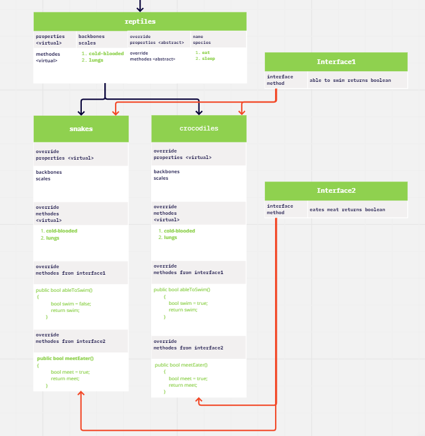

# ZOO -lab 07
this is  a simple program divided into classes that is used to show a simple zoo UML diagram and show the inhertance and the diffrent kinds of classes and the polymorphism and also including the overriding for abstract and virtual classes so as you will see below the animal is the base class and also the abstract class for 3 classes that are also abstract classes (mammals,birds, reptiles) then this classes have classes under them as children for example mammals is the parent for the lion class (the lion class is a concret class) .
## UML Diagram for the zoo:


## updated uml interface added 


## The 4 concepts of OOP:
1. Encapsulation: Bundling data and related operations together within a class, providing a neat package that protects the data from outside interference and allows controlled access through defined interfaces.

2. Inheritance: Creating new  classes by inheriting properties and behaviors from existing classes, enabling code reuse and the creation of specialized subclasses that add or modify functionality.

3. Polymorphism: Treating objects of different classes as if they were objects of a common superclass, allowing for interchangeable usage and the ability to override methods to provide different implementations.

4. Abstraction: Simplifying complex systems by focusing on essential features and hiding unnecessary details, providing a high-level view that aids understanding and managing complexity.


##	This are some examples of usage of Polymorphism in the code:
1. Polymorphism with the `Mammals` class:
   - `Mammals` is a superclass that defines common properties and behaviors of mammals.
   - `Lion` and `Rabbit` are subclasses of `Mammals` and inherit its properties and behaviors.
   - The objects `m1` and `m2` are created as instances of `Lion` and `Rabbit` respectively but are declared as `Mammals`.
   - Even though `m1` and `m2` are declared as `Mammals`, they can still access the overridden methods specific to their subclasses (`Sleep()` and `Birth()`).
   - This allows different types of mammals to be treated uniformly as `Mammals` while invoking their specific behaviors.

2. Polymorphism with the `Bird` class:
   - `Bird` is a superclass that defines common properties and behaviors of birds.
   - `Parrot` is a subclass of `Bird` and inherits its properties and behaviors.
   - The object `b1` is created as an instance of `Parrot` but is declared as `Bird`.
   - Similarly to the `Mammals` example, even though `b1` is declared as `Bird`, it can still access the overridden methods specific to `Parrot` (`Sleep()` and `Fly()`).
   - This allows different types of birds to be treated uniformly as `Bird` while invoking their specific behaviors.


## Interface :
Interface is a contract that defines a set of member signatures without implementation details.
 It serves as a blueprint for classes to follow, specifying the methods, properties, and events they must provide. 

## Where are the interface used in my code:

there are 2 interfaces in my code which are could `interface1` and `interface2`
and they both are inheriting the classes Crocodile and snake which are concert classes in my code
an example about them is for `interface1` inheriting the class `snake` the method `ableToSwim()` :
this is the implementation fo the `interface1` on `snake`
```c#
public class Snake:Reptile,Interface1
...
 public bool ableToSwim()
        {
            bool swim = false;
            return swim;
        }
```
this is the `interface1` definition
```c#
namespace animals.@interface
{
    public interface Interface1
    {
        bool ableToSwim();
    }
}


```